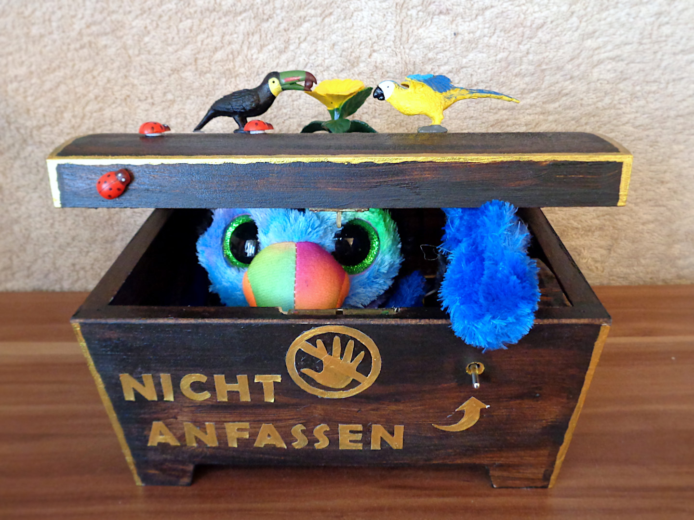
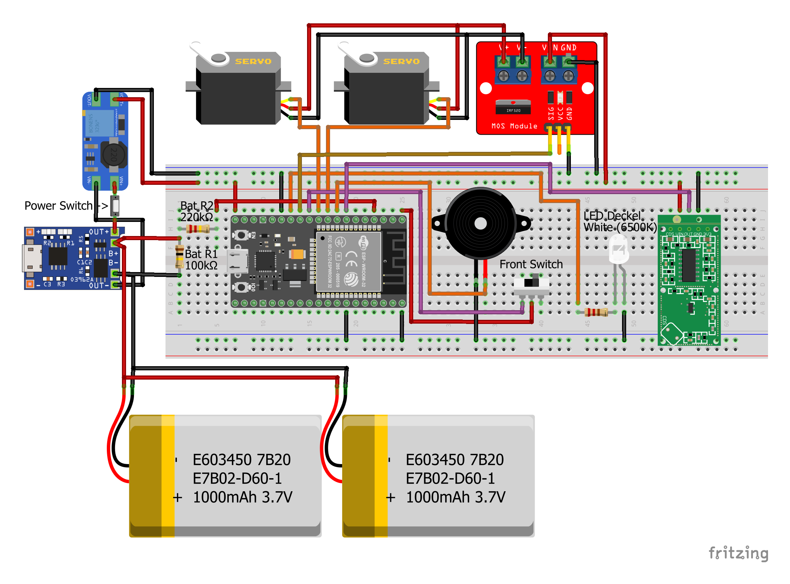

# Useless Box
Arduino Sketch for a Useless Box I build for our little one. Maybe it helps someone with their own Useless Box, especially with the part
of moving the Servos while simultanously changing other PWM controlled components.

## Description
Our variant of the Useless Box has some additional features. Here is the full list of features and components that define this variant:

* **MG996R Servo**, which is strong enough to lift the Cover
* **9g 180° Clutch Servo** from DFRobot, which moves the Hand
* **RCWL-0516 Microwave Radar** which uses the doppler effect to detect movement even through the wooden box
* **Piezo Buzzer** for a simple birdlike sound
* **TP4056 LiPo Charger** including some LiPo batteries

## Fritzing Circuit

## Dependencies
The Sketch needs some libraries to work. As things move on, some libraries might have newer versions that break the Sketch. If you
really want to compile and use it yourself without changes, you need the following library versions. I would recommend you only use
this repository for inspiration and knowledge, because I will not always keep things up-to-date.

### Arduino IDE Libraries
* arduino-esp32 (1.0.6)
* AsyncTCP (1.1.4)
* ESP32Servo (0.13.0)
* RunningMedian (0.3.9)

### GitHub Libraries
* https://github.com/marvinroger/async-mqtt-client (v0.9.0) \
  The Arduino IDE Library is newer, but untested by me. I used the latest version from the original author.
* https://github.com/lbernstone/Tone32.git (v1.0.1) \
  The Arduino IDE Library got replaced somehow and is quite different. This one is more in line with the original Arduino implementation.
